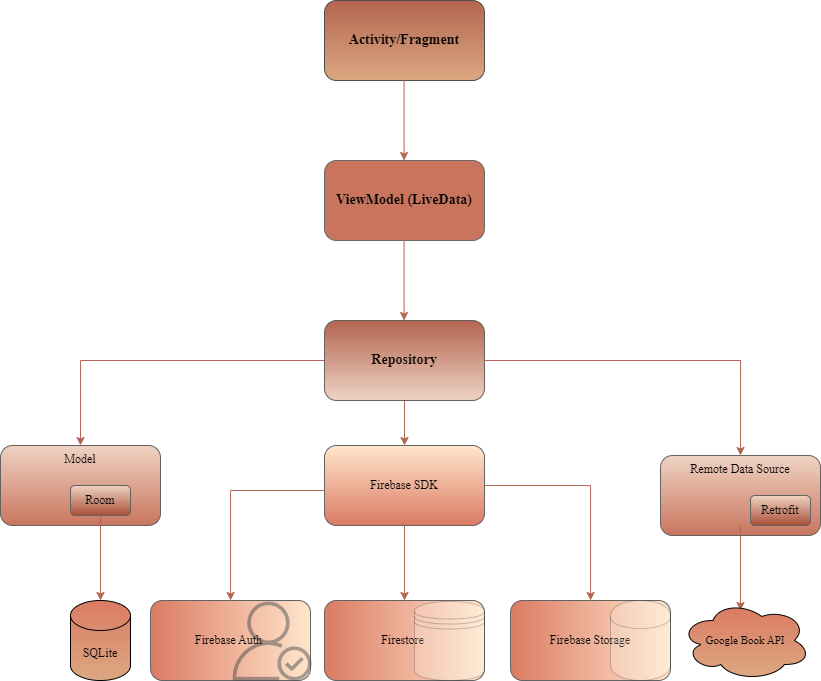

# BookMatch

BookMatch is an application designed for book lovers who wish to explore new titles in an intelligent and personalized manner. With BookMatch, users can discover a wide range of books based on their tastes and literary preferences.

**Group name: Mindset**

**Academic Year**: 2023/2024

**Members:**
- Andrea Falbo: 887525
- Youness Karzal: 879430
- Lorenzo Rota: 887451
- Ruben Tenderini: 879290

## Introduction

### What is BookMatch?
BookMatch is an application designed for book enthusiasts, enabling them to explore and discover new books tailored to their preferences.

### Our Slogan
BookMatch: Find your next literary adventure!

### Summary
BookMatch welcomes users with a guided tour through its features via an intuitive stepper. After registration or login, users can explore the platform, divided into five sections:

1. **Explore**: Select your favorite literary genre and discover a variety of recommended books.
2. **Saved**: Quickly access books saved for future reading.
3. **Favorites**: Provide reviews and ratings for your saved books.
4. **Collections**: Create and manage personalized book collections.
5. **Profile**: View your activity statistics and update profile information, including login details and literary preferences.

## Features

### Use Cases
**Informative Onboarding**
- BookMatch, upon app launch, guides the user through the informative onboarding, which provides an overview of the app's features.

**User Registration**
- The user can choose to register as a new user by providing the necessary information.

**User Authentication**
- The user has the option to authenticate with the information provided during the registration phase.
- The user can check a box to ask the system to remember their login credentials, so they don't have to log in every time they visit the app.
- The user can authenticate through their Google account, allowing immediate access to the application.

**Book Exploration**
- BookMatch presents sequential book exploration, where books are displayed one at a time, filtered by genre.
- The user can browse the books, get more information by clicking on the item, save a book for future reading, remove it from the list, or keep it on hold for further exploration.

**Saved Books**
- BookMatch shows the books saved by the user in the "Saved" section.
- The user can remove a book from the Saved list, get additional information by clicking on the item, or add that book to the Favorites.

**Favorite Books**
- BookMatch shows the user's favorite books in the "Favorites" section.
- The user can remove a book from the Favorites list or provide a review and rating.

**Collections**
- BookMatch shows the user's created collections in the "Collections" section.
- The user can create personalized collections of books to organize their preferences based on specific themes or interests.
- The user can add books to their collections.
- The user can edit a previously created collection.

**User Profile**
- BookMatch displays information related to the user's preferences, authentication information, and details on the number of saved books, favorites, and created collections.
- The user can edit their profile, updating information about their favorite book, author, and genre, as well as authentication information.
- The user can log out.
- The user can get more information about the app developers by being redirected to the BookMatch Github repository.

### External Services
- **Google Books API**: Enables searching and retrieving book information.
- **FirebaseAuth**: Handles user authentication via email/password or Google account.
- **SQLite**: Manages local application data storage.
- **Firestore**: Stores user information and preferences.
- **Firebase Storage**: Saves user profile images.

## Architecture

### Model - View - ViewModel (MVVM)
- **Model**: Abstracts data sources, working with ViewModel to get and save data.
- **View**: Informs ViewModel of user actions and observes ViewModel without containing any business logic.
- **ViewModel**: Links Model and View, exposing data streams relevant to the View.

**Components**:
1. **Activity and Fragment**: Manage the application's visual interface, update UI elements, and handle navigation.
2. **ViewModel**: Bridges UI and Repository, updating UI with LiveData.
3. **Repository**: Retrieves data from the database and APIs, updating LiveData in ViewModel.

## Project Management
- **Github**: Used for version control.
- **Discord**: Facilitated regular meetings and agile development using Scrum.
- **Excalidraw**: Used for initial sketches and interface design.

## Libraries
- **Google Play Services**: Enables Google account authentication.
- **Retrofit**: Simplifies HTTP network calls.
- **Firebase**: Manages user authentication and cloud services.
- **Glide**: Handles image loading and display.

## Design
The design prioritizes user experience, adhering to Material Design 3 guidelines with both Light Mode and Dark Mode themes.

## Classes

### Adapter Classes
- **AddBookToCollectionRecyclerViewAdapter**: Adapter for saved books to add them to collections.
- **CardStackAdapter**: Displays book information in the Explore section.
- **CollectionsContainersRecyclerViewAdapter**: Shows user-created collections.
- **CollectionGroupsRecyclerViewAdapter**: Displays items in a collection.
- **OnboardViewPagerAdapter**: Handles onboarding view pager.
- **ReviewsRecyclerViewAdapter**: Shows user-created book reviews.
- **SavedRecyclerViewAdapter**: Shows saved books.

### Database Classes
- **BookDao**: Data access object for Book class.
- **BookRoomDatabase**: Database class for Book.
- **CollectionContainerDao**: Data access object for Collection class.
- **CollectionContainerRoomDatabase**: Database class for Collection.
- **CollectionGroupDao**: Data access object for books in a collection.
- **CollectionGroupRoomDatabase**: Database class for books in a collection.

### Repository Classes
- **BookRepository**: Methods for ViewModel related to Book class.
- **BookSavedLiveData**: Local saves of books for offline access, with periodic API dumps.

### Utility Classes
- **AccountManager**: Manages local authentication information.
- **Constants**: Holds constant values.
- **Converters**: Data conversion methods for Room.
- **DataEncryptionUtil**: Utility for data encryption.
- **JSONParser**: Parses JSON data.
- **ServiceLocator**: Singleton for providing service instances.
- **SharedPreferencesUtil**: Methods for reading/writing SharedPreferences.

## Layouts
Main layouts include:
- **Onboarding**: Introduces users to the app's features.
- **Authentication**: Allows new user registration or existing user login.
- **Explore**: Discover books based on interests.
- **Saved**: Quickly access saved books.
- **Favorite**: Manage and review favorite books.
- **Collection**: Create and manage book collections.
- **Account**: Update profile and authentication details.
- **Modify Account**: Edit profile information.

For more details, refer to the full [Documentation](docs/Documentazione_BookMatch.pdf).

---

For any questions or contributions, please visit our [GitHub repository](https://github.com/Ruben-2828/BookMatch).
